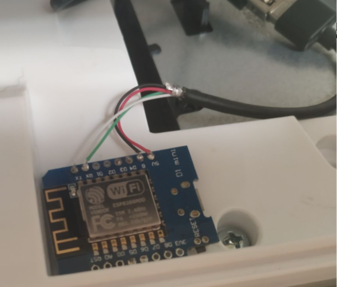
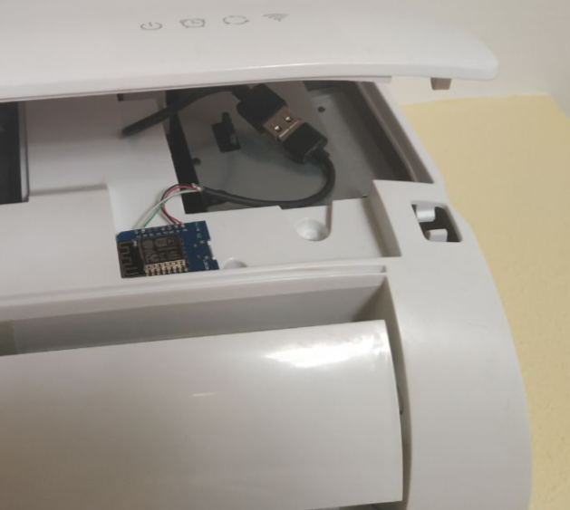

 # ESP Haier
 
 ESP Haier is a project to use a ESP8266 (I did not test with ESP32) to control Haier Air Conditioner with wifi module supoort with ESPHome and Home Assisant.

Works as reemplace of KZW-W001 and KZW-W002.
 

You only need configure esphaier.yml, put Haier.h in the same directory and flash. 
 
Home Assisant will recognize as climate device.
 
For now, ESPHome climate component don't support fan speed or swing, so, ESP Haier neither. When esphome will have support, I will add it.
 
This project is based in the works of Instalator and his project [Haier Wifi](https://github.com/instalator/Haier_WiFi/)
 
 
 I use a Wemos D1 Mini.
 
 - Red -> 5V 
 - Black -> GND 
 - Green -> RX 
 - White -> TX

For replace KZW-W002, use "hacked" USB cable. I cut the USB cable and connect 

